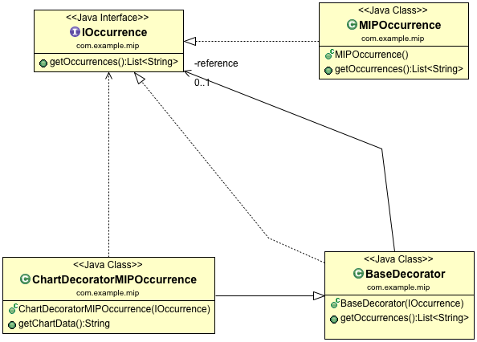
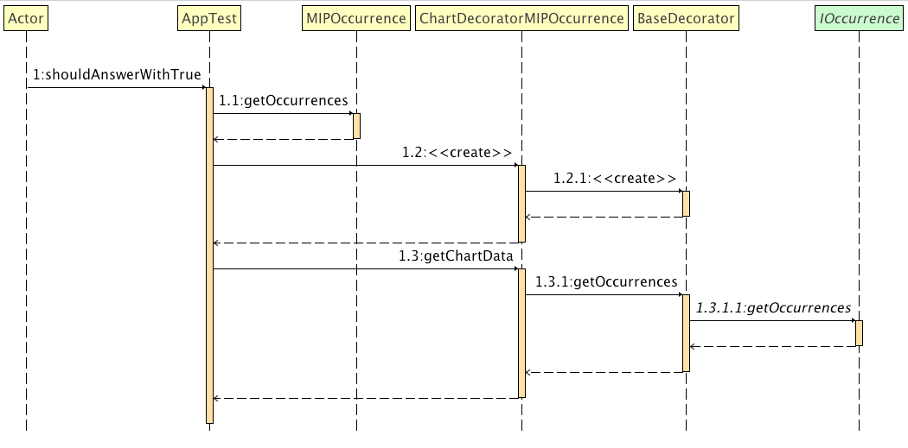

# Decorator Design Pattern Example
Although this project is not based on any particular tutorial, I mainly used the [Refactoring Guru](https://refactoring.guru/design-patterns/decorator) explanation as reference when implementing the code.

## Project Overview
There is a base class representing a business entity (`MIPOccurrence`). This entity has base operations that define its basic behaviour (`IOccurrence`). However, we assume a dashboard needs additional operations to generate charts. Instead of adding these chart operations into the entity, we extended the entity by using the _decorator_ pattern (`ChartDecoratorMIPOccurrence`).

## Class Structure



* `IOccurrence` represents the set of common operations for any `MIPOccurrence` entity. This interface is used by all classes in this project;

* `MIPOccurrence` is the base class. It implements the `IOccurrence` operations. This represents the basic behaviour of an _occurrence_;

* `BaseDecorator` is the superclass that defines a _decorator_. As `MIPOccurrence`, it implements `IOccurrence` operations. Thus, both `MIPOccurrence` & `BaseDecorator` are `IOccurrence`. Classes that add new behaviour to `MIPOccurrence` must extend `BaseDecorator`. This class has a parameter in the constructor, used to wrap the base class (`MIPOccurrence`);

* `ChartDecoratorMIPOccurrence` represents the operations necessary for creating dashboard charts. This class extends `BaseDecorator` and, therefore, is also an `IOccurrence`. To extend `MIPOccurrence` behaviour, it _wraps_ `MIPOccurrence` by using the constructor parameter, on the class instantiation. The `ChartDecoratorMIPOccurrence` method, `getChartData()` uses `MIPOccurrence` base operations, implemented from `IOccurrence`, to generate data for the chart. 

## Flow Structure



The Figure shows the test execution. A `MIPOccurrence` is firstly created. Its method `getOccurrences()` is called to test the entity is working. Second, the `ChartDecoratorMIPOccurrence` class is instantiated, as it is `BaseDecorator`, due to the inheritance. 

During the instantiation, `ChartDecoratorMIPOccurrence` wraps the `MIPOccurrence` instance. Finally, the `ChartDecoratorMIPOccurrence` method, `getChartData()`, uses the `getOccurrences()` method to extract data for generating the chart. 

Notice that this diagram is deeper than necessary, as it shows both `BaseDecorator` and `IOccurrence` - but, it may help understand better the inheritance role. 

## Project Setup
```
mvn clean test
```
